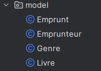
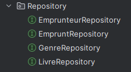
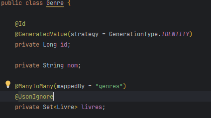
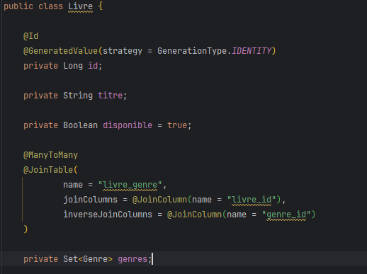
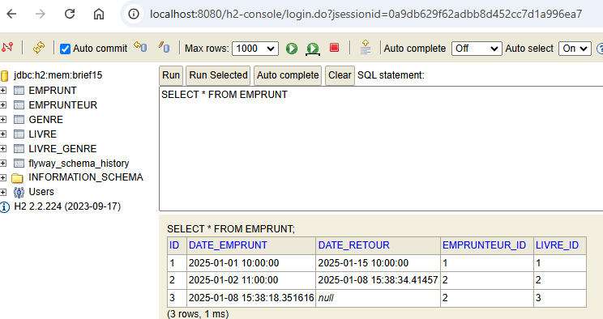
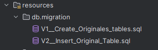
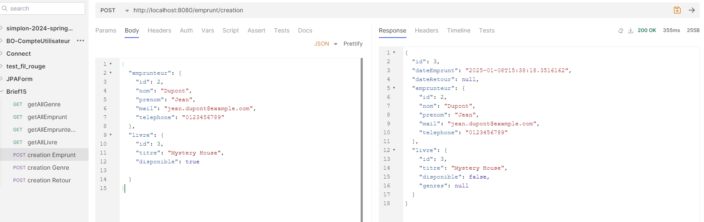
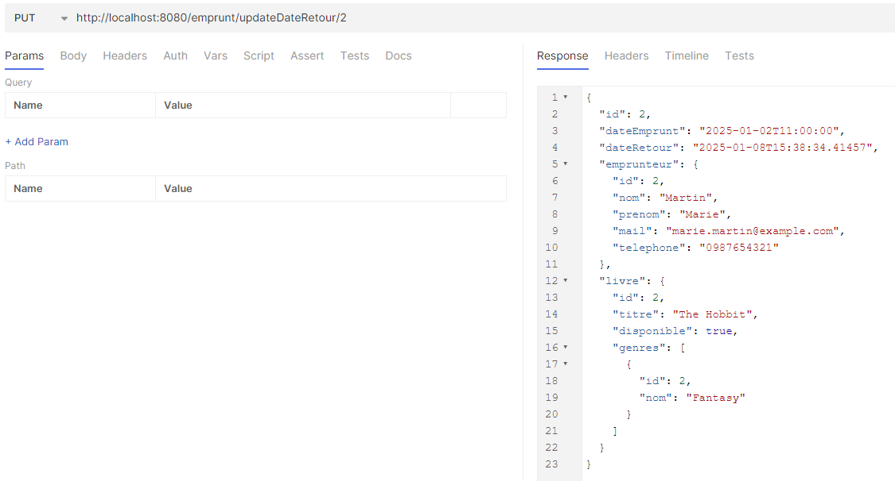

# Brief 15 - Création application gestion de bibliothèque

## Entity

## Repository

## Exemple de relation entre Entity

## Tables

## Migrations - Flyway
Une première migration crée les tables et une deuxième insert les données.

## Fonctionnalités disponibles

Un certain nombre de fonctionnalités classiques telles que "creation genre" sont présentes.

Les fonctionnalités "Creation emprum" et "Retour emprumt" sont celles qui mérite le plus d'attention.

Creation emprumt

Retour emprumt

## Gestion disponibilité des livres
La gestion de la disponibilité des livres est effectuée au niveau du service. Lors de la création d'un emprunt, la disponibilité du livre est mise à jour pour indiquer qu'il n'est plus disponible (disponible = false). Lorsque le livre est retourné, sa disponibilité est rétablie (disponible = true).